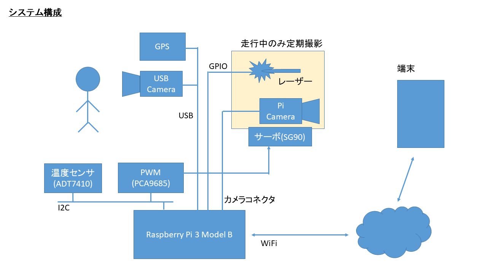
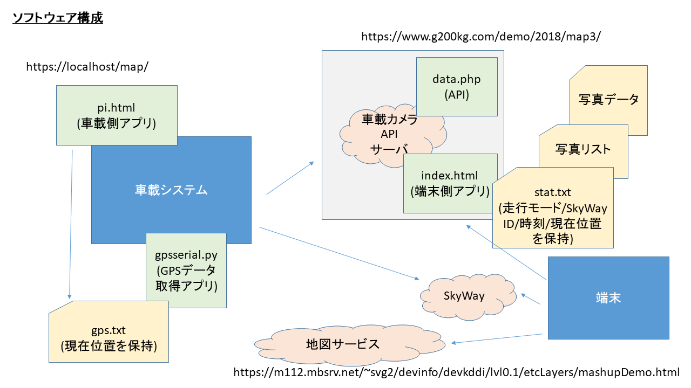
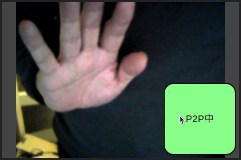
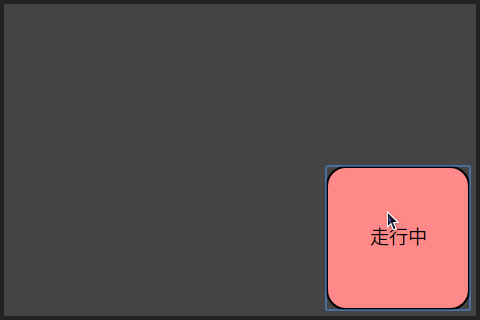
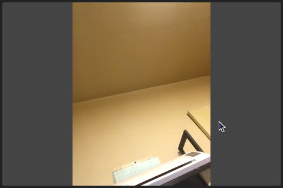

# 車載カメラデモ

## システム構成


## ソフトウェア構成
  

各ソフトウェアは上図のように配置される。各ソフトウェアの機能は以下の通り。

車載システム側 (https://localhost/)  
* map/pi.html  
  車載カメラのメインプログラム  
  ~/.config/lxsession/LXDE-pi/autostart で Chromiumの起動ページに指定  

* map/gpsserial.py  
  シリアルからGPSを読み取り、gps.txt に保持するpythonプログラム  
  ~/.config/lxsession/LXDE-pi/autostart から起動  

* map/gps.txt  
  最新 GPS データ。GPS の最後の有効な $GPRMC 行を保持


車載カメラAPIサーバ (https://www.g200kg.com/demo/2018/)  

* map/index.html  
  端末側メインプログラム。端末からアクセスされ、端末側で動作する。  

* map/data.php  
    車載カメラメインプログラム、端末側メインプログラム、地図サーバーからアクセスされ、以下の動作を行う。
  *  写真データ、モード関係の API  
  *  写真/GPSデータリスト蓄積  
  *  写真/GPSデータリスト送出  
  *  写真サムネイル作成  
  *  現在の走行モード、SkyWay ID、時刻、位置の登録/取得  

* map/d/  
  写真データ蓄積ディレクトリ。ポストされた写真はここに蓄積される。

* map/stat.txt  
  現在の走行モード、SkyWay ID、時刻、位置を保持するファイル

地図サービス  (https://m112.mbsrv.net/~svg2/devinfo/devkddi/lvl0.1/etcLayers/mashupDemo.html)  
*  地図表示を行う。また写真データにアクセスし、地図上の写真/サムネイルの表示等を行う。

## モード遷移
  
車載カメラおよび端末は上図のモード遷移を行う。  
現在のモードは車載カメラ側が APIサーバー上の map/stat.txt に周期的に書き込み、端末はそれをポーリングする事で更新される。  端末から見た時の[待機中]状態は車載カメラ側が動作していない状態であり、map/stat.txt が現在時刻から見て30秒以上更新されていない状態である。

## 車載カメラ側UI
* P2P中  
P2P中は自分のUSBカメラ画像及びモード切替ボタンを表示する  
  

* 走行中  
走行中はモード切替ボタンのみ表示する  
  

* 通話中  
通話中は相手画像のみ表示  
  

## GPSデータのハンドリング
GPSモジュールはUSB接続のGT-730F/L(SiRF)を使用する。  
http://akizukidenshi.com/catalog/g/gM-09272/

USBで接続すると

>/dev/serial/by-id/usb-STMicroelectronics_STM32_Virtual_COM_Port_1584324D3431-if00

 からアクセスできる。このポートから1秒毎に NMEA フォーマットのセンテンスが出力されている。

gpsserial.py により、NMEAセンテンス中緯度経度情報が含まれる $GPRMC センテンスのみを抽出し、gps.txt ファイルにそのまま書き込む。pi.html からはサーバー側のファイルとして gps.txt ファイルを読み込み、適宜位置情報を使用する。  

> 例)  
> $GPRMC,085120.307,A,3541.1493,N,13945.3994,E,000.0,240.3,181211,,,A*6A

ここでカンマで区切られた3番目の要素が”A” の場合、ステータスとして有効であり、”V” の場合はGPSデータが取れていないため無視する。

位置情報は$GPRMCセンテンスの4番目、6番目の要素にある。位置情報はNMEAフォーマットでは、度分を組み合わせたものであるが、pi.html/data.phpでは内部的に度の小数点表現を使用するため都度変換を行う。  

```
  latstr = NMEAのlat表現
  lngstr = NMEAのlng表現
  lat=((latstr/100)|0)+((latstr/100)-((latstr/100)|0))/60*100
  lng=((lngstr/100)|0)+((lngstr/100)-((lngstr/100)|0))/60*100;
```

---
## 地図サービスとのI/F

地図サービスが提供する地図描画機能は、端末側プログラム内で iframe に読み込む。端末側プログラムのオリジンとなる API サーバーと地図サービスは別オリジンとなるため、それぞれ CORS 設定が必要である。

* ヘッダに Access-Control-Allow-Origin: * を付与
* 地図側は iframe に読み込むため、X-Frame-Options: SAMEORIGIN がない事
* また、getUserMedia を使用するためプロトコルは https 必須となる

### 地図サーバへのリクエスト時のURL
端末アプリから地図サービスへのクエリーには「?data=」に続けて使用する data.php への絶対URLを付加する。この時data=で指定される URL はencodeURIComponentでエンコードされているため、地図サービス側ではdecodeURIComponentでデコードしてdata.phpへのパスを得る事ができる。

>例)  
>https://m112.mbsrv.net/~svg2/devinfo/devkddi/lvl0.1/etcLayers/mashupDemo.html?data=https%3A%2F%2Fwww.g200kg.com%2Fdemo%2F2018%2Fmap3%2Fdata.php

端末からhttps://www.g200kg.com/demo/2018/maptest/　(落書き版)
または
https://www.g200kg.com/demo/2018/map3/ (カメラ画像版)
にアクセスした場合、それぞれ地図サーバには  .../2018/maptest/data.php または ..../2018/map3/data.php が渡される。

## data.php の仕様

写真データを供給するAPI。アクセスすると JSON 形式でデータを返す。

動作させるためにデータを取るURLを2つ用意している。

https://www.g200kg.com/demo/2018/maptest/data.php  
実験用として適当な画像 (png または jpg、最大100個) を横浜周辺の適当な座標に配置。

https://www.g200kg.com/demo/2018/map3/data.php  
カメラで撮った画像(png)。座標はGPSのものが入っているが今の所移動していないためほぼ固定値になっている。

#### JSON の構造
* lastpos : 最後に取れたGPS座標(車の現在位置)
  * lat : 緯度。NMEAフォーマットの度分ではなくgoogleMap等で使用される10進数。
  * lng : 経度。NMEAフォーマットの度分ではなくgoogleMap等で使用される10進数。
* thumbnail : 画像データのサムネイル情報。
  * thumbnail.img : 63x63サイズのサムネイルを縦方向に接続した画像のurl
  * thumbnail.css : サムネイル表示用CSSのurl
* data : 各写真データの情報の配列(長さは最大100)。
  要素は時系列でソートされ、最新の画像がdata[0]、最も古い画像がdata[99]となる。
  * date : 撮影日時。各画像のファイル名にもそのまま使用。
  * type : 画像の形式。実験用は "png" または "jpg"。カメラ画像で稼働させた時には "png" のみ。
  * lat : 緯度。NMEAフォーマットの度分ではなくgoogleMap等で使用される10進数。
  * lng : 経度。NMEAフォーマットの度分ではなくgoogleMap等で使用される10進数。
  * tmp : 撮影時の温度情報。摂氏を表す10進浮動小数。
  * url : 画像データ本体を指すURL。

#### thumbnail.img の構成
* 画像は最大100個だが稼働を始めてから100個の画像が溜まっていない場合はそれ以下の場合もある。画像の個数はdata.php が返すデータの data[] 配列の長さに一致。
* 63x63サイズのサムネイル画像を全て縦に連結した1枚の画像。
* 画像の順序は時系列で一番上にあるものが最新、下に行くほど過去の画像。
  data.phpとの関係は以下の通り

|data.phpのdata配列|sprite.png内の位置|表示用オフセット|クラス名|
|-----|----|----|
|data.phpのdata[0]|sprite.pngの一番上|-0px -0px|.sprite1 |
|data.phpのdata[1]|sprite.pngの2番目|-0px -63px|.sprite2 |
|data.phpのdata[2]|sprite.pngの3番目|-0px -126px|.sprite3 |
|・<br/>・<br/>・<br/>||||
|data.phpのdata[99]|sprite.pngの一番下|.sprite100| -0px -6237px|


```
{
 "lastpos":{"lat":35.81295394143582,"lng":139.66292809321635},
 "thumbnail":{"img":"https://g200kg.com/demo/2018/maptest/sprite.png","css":"https://g200kg.com/demo/2018/maptest/sprite.css"},
 "data":[
  {"date":"20180218224144","type":"png","lat":35.812953941436,"lng":139.66292809322,"tmp":20,"url":"https://g200kg.com/demo/2018/maptest/d/20180218224144.png"},
  {"date":"20180218224041","type":"png","lat":35.766039567776,"lng":139.74319580741,"tmp":20,"url":"https://g200kg.com/demo/2018/maptest/d/20180218224041.png"},
  ・
  ・
 ]
}
```

### data.php のパラメータ

GET動作
* GET data.php  
 * 追加パラメータ無しでdata.phpにGETアクセスした場合は上記の写真データリストを返す。  


* GET data.php?cmd=getst  
 * 現在のモード/SkyWayのpeerID/登録時刻を取得する。  
 {"drive":0,"pid":"fp4TniixYHNNnfGR","time":1520056248}


POST動作  
  multipart/form-data でデータを送る。formのcmdデータによって挙動が変化する。

*  現在のモード/SkyWayのperrID/時刻を登録する。
  * cmd = "setst"
  * drive = 現在のモード 0:P2P、1:走行、2:通話中
  * pid = SkyWay の peerId
  * time = 現在時刻 (Unix time)
  * lat = 現在の緯度
  * lng = 現在の経度


*  写真データを追加する。
  * cmd = "add"
  * lat = 撮影時の緯度
  * lng = 撮影時の経度
  * tmp = 撮影時の温度
  * file = 追加する写真データ

## システムを動作させる際の設定

### API-KEY
 チャット機能端末側の index.htm (Line188) および raspi側の pi.html (Line203) には SkyWay の API-KEY を設定する必要がある。 システムを構築する場合は [SkyWayのサイト](https://webrtc.ecl.ntt.com/) で登録を行い、取得した API-KEY に書き直す。

### RasPi 側の設定
* RasPi の /home/pi/Desktop/gc/map ディレクトリに以下のファイルがある事
 * pi.html -- 車載側アプリ  
 * gpsserial.py -- GPS 読み取りアプリ
*  RasPiのブラウザからは https://localhost/map/pi.html にアクセスする。  

*  apiサーバーの URL、および走行時の写真ポスト間隔は pi.html の中で定義されている。必要に応じて編集する。

  ```
  pi.html Line:68
  const apiurl="https://www.g200kg.com/demo/2018/map3/data.php";  // url of api server
  const postinterval=300000;  // photo post interval (msec)
  ```

* chrome:settingsのマイクの設定でUVCカメラのマイクを選択している事。デフォルト[規定]では動作しない
* chromium は --kiosk モードを想定
* ディスプレイ(MPI3508)
  解像度 480 x 320 を想定
  ```
  /boot/config.txt
    hdmi_group=2
    hdmi_mode=87
    hdmi_cvt 480 320 60 6 0 0 0
  ```
* タッチパネルの設定(MPI3508)  
  xy座標をスワップ
  ```
  /boot/config.txt
    dtparam=spi=on
    dtoverlay=ads7846,penirq=25,speed=10000,penirq_pull=2,xohms=150,swapxy=1
  ```
  x値、y値がそれぞれ反転しているため libinput.confで反転する。

  ```
  /usr/share/X11/xorg.conf.d/40-libinput.conf  
  Identifier "libinput touchscreen atchall" 内

  Option "TransformationMatrix" "-1 0 1 0 -1 1 0 0 1"
  ```

## サーバー側の設定
サーバーは端末からブラウザでアクセスするサーバーであり、また data.php が稼働するサーバーとなる。

*  httpsで接続できるサーバーを用意する。
*  サーバーには以下のファイルを準備  

適当なフォルダ/  
　├ index.html  
　├ data.php  
　├ images/  
　│　├ laser.svg  
　│　└ selcam.svg  
　└ d/  

*  RasPi で起動する pi.html (68行目:apiurl) には data.php へのURLをハードコードしておく。
*  端末から index.html の URL にアクセスする。

## リファレンス
SkyWay :  
 [https://webrtc.ecl.ntt.com/skyway-js-sdk-doc/](https://webrtc.ecl.ntt.com/skyway-js-sdk-doc/)  

Media Stream Image Capture :  
 [https://w3c.github.io/mediacapture-image/index.html](https://w3c.github.io/mediacapture-image/index.html)  

NMEAフォーマット :  
 [http://www.hiramine.com/physicalcomputing/general/gps_nmeaformat.html](http://www.hiramine.com/physicalcomputing/general/gps_nmeaformat.html)
